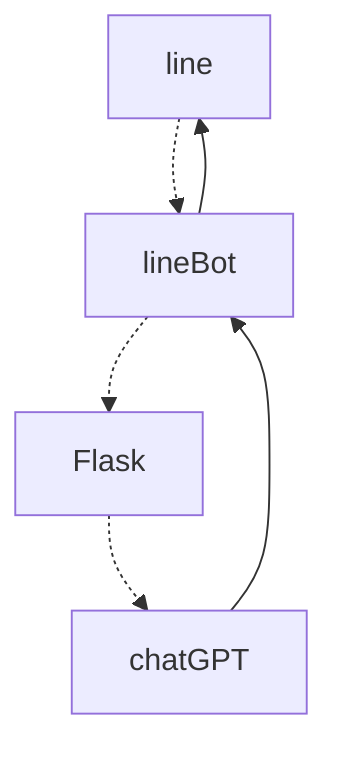

# open AI on python
Python 是一種流行的編程語言，因其易用性而常用於數據應用、網頁開發以及其他許多編程任務。OpenAI 提供了一個自定義的 Python 庫，使得在 Python 中使用 OpenAI API 變得簡單高效。

## 步驟 1：設置 Python
安裝 Python
要使用 OpenAI 的 Python 庫，您需要確保已安裝 Python。一些電腦預裝了 Python，而其他電腦需要您自行設置。要測試是否已安裝 Python，可以導航到您的終端或命令行：

### MacOS：打開終端（Terminal）：可以在應用程序文件夾中找到它，或使用 Spotlight（Command + Space）搜索。

### Windows：打開命令提示符（Command Prompt）：可以在開始菜單中搜索 "cmd" 找到它。

接下來，輸入 "python" 並按回車。如果進入了 Python 解釋器，則表明您已經在電腦上安裝了 Python，您可以進入下一步。如果收到類似 "Error: command python not found" 的錯誤消息，則可能需要安裝 Python 並使其在終端/命令行中可用。

要下載 Python，請前往 Python 官方網站並下載最新版本。要使用 OpenAI 的 Python 庫，您需要至少 Python 3.7.1 或更新版本。如果您是第一次安裝 Python，可以遵循官方的 Python 安裝指南。

## 設置虛擬環境（可選）
一旦安裝了 Python，建立一個虛擬環境來安裝 OpenAI 的 Python 庫是一個好習慣。虛擬環境提供了一個乾淨的工作空間來安裝您的 Python 套件，這樣就不會與其他項目安裝的庫發生衝突。如果您不想設置虛擬環境，可以跳過此步驟。

要建立虛擬環境，Python 提供了一個內建的 venv 模塊，它提供了建立虛擬環境所需的基本功能。執行以下命令將在您當前選定的終端/命令行文件夾中建立一個名為 "openai-env" 的虛擬環境：

```
python -m venv openai-env
```
一旦您建立了虛擬環境，您需要啟動它。

### 在 Windows 上，運行：

```
openai-env\Scripts\activate
```
### 在 Unix 或 MacOS 上，運行：

```
source openai-env/bin/activate
```
啟動虛擬環境後，終端/命令行界面應該會有些微變化，現在應該在光標輸入區域的左側顯示 "openai-env"。有關虛擬環境的更多詳細信息，請參閱官方的 Python 文檔。

### 安裝 OpenAI 的 Python 庫
一旦您安裝了 Python 3.7.1 或更新版本並（可選）設置了虛擬環境，可以安裝 OpenAI 的 Python 庫。在終端/命令行中運行：

```
pip install --upgrade openai
```
安裝完成後，運行 pip list 將顯示當前環境中安裝的 Python 庫，應該可以確認 OpenAI 的 Python 庫已成功安裝。


## 步驟 2：設置您的 API 密鑰
為所有項目設置您的 API 密鑰（推薦）
使 API 密鑰對所有項目可用的主要優點是 Python 庫會自動檢測並使用它，無需編寫任何代碼。

### MacOS
打開終端：可以在應用程序文件夾中找到它，或使用 Spotlight（Command + Space）搜索。

編輯 Bash 配置文件：使用命令 `nano ~/.bash_profile` 或 `nano ~/.zshrc`（對於較新版本的 MacOS）在文本編輯器中打開配置文件。

添加環境變量：在編輯器中，添加以下行，將 `your-api-key-here` 替換為您的實際 API 密鑰：

```
export OPENAI_API_KEY='your-api-key-here'
```
保存並退出：按 `Ctrl+O` 來寫入更改，然後按 `Ctrl+X` 關閉編輯器。

加載配置文件：使用命令 `source ~/.bash_profile` 或 `source ~/.zshrc` 加載更新的配置文件。

- 驗證：在終端中輸入 echo $OPENAI_API_KEY 驗證設置。應顯示您的 API 密鑰。

### Windows
打開命令提示符：可以在開始菜單中搜索 `cmd` 找到它。

在當前會話中設置環境變量：使用以下命令設置環境變量，將 your-api-key-here 替換為您的實際 API 密鑰：

```
setx OPENAI_API_KEY "your-api-key-here"
```
這個命令將為當前會話設置 OPENAI_API_KEY 環境變量。

永久設置：要使設置永久生效，通過系統屬性添加變量：

右鍵點擊“此電腦”或“我的電腦”，選擇“屬性”。
點擊“高級系統設置”。
點擊“環境變量”按鈕。
在“系統變量”部分，點擊“新建...”並輸入 OPENAI_API_KEY 作為變量名稱，並輸入您的 API 密鑰作為變量值。
驗證：重新打開命令提示符，輸入以下命令進行驗證。應顯示您的 API 密鑰：

```bash
複製程式碼```
echo %OPENAI_API_KEY%
```
為單個項目設置您的 API 密鑰
如果您只希望您的 API 密鑰對單個項目可用，可以創建一個包含 API 密鑰的本地 `.env` 文件，然後在 Python 代碼中顯式使用該 API 密鑰。

首先，進入您想要創建 `.env` 文件的項目文件夾。

為了使您的 `.env` 文件不被版本控制忽略，在項目目錄的根目錄創建一個 .gitignore 文件。在其中添加一行 `.env`，這將確保您的 API 密鑰或其他秘密不會意外通過版本控制共享。

使用終端或集成開發環境（IDE）創建 `.gitignore` 和 `.env` 文件後，複製您的秘密 API 密鑰並將其設置為 `.env` 文件中的 OPENAI_API_KEY。如果您還沒有創建秘密密鑰，可以在 API 密鑰頁面上創建。

`.env` 文件應如下所示：

```
# 一旦添加您的 API 密鑰，請確保不要與他人分享！API 密鑰應保持私密。

OPENAI_API_KEY=abc123
```
可以通過運行以下代碼導入 API 密鑰：

```python
from openai import OpenAI

client = OpenAI()
# 默認使用 os.environ.get("OPENAI_API_KEY") 獲取密鑰
# 如果您將密鑰保存為其他環境變量名稱，可以這樣做：
# client = OpenAI(
#   api_key=os.environ.get("CUSTOM_ENV_NAME"),
# )
```

## 步驟 3：發送您的第一個 API 請求
發送 API 請求
在配置好 Python 並設置 API 密鑰後，最後一步是使用 Python 庫向 OpenAI API 發送請求。為此，使用終端或 IDE 創建一個名為 openai-test.py 的文件。

在文件內，複製並粘貼以下示例之一：
```python
from openai import OpenAI

client = OpenAI()

completion = client.chat.completions.create(
  model="gpt-3.5-turbo",
  messages=[
    {"role": "system", "content": "You are a poetic assistant, skilled in explaining complex programming concepts with creative flair."},
    {"role": "user", "content": "Compose a poem that explains the concept of recursion in programming."}
  ]
)

print(completion.choices[0].message)
```
要運行代碼，輸入 `python openai-test.py` 到終端/命令行。

這個 `Chat Completions` 示例展示了我們模型的一個強項：創造能力。用一首格式良好的詩解釋遞歸這個編程概念，這是最好的開發者和最好的詩人都會感到困難的事情。而在這種情況下，`gpt-3.5-turbo` 輕鬆完成了這個任務。
---


